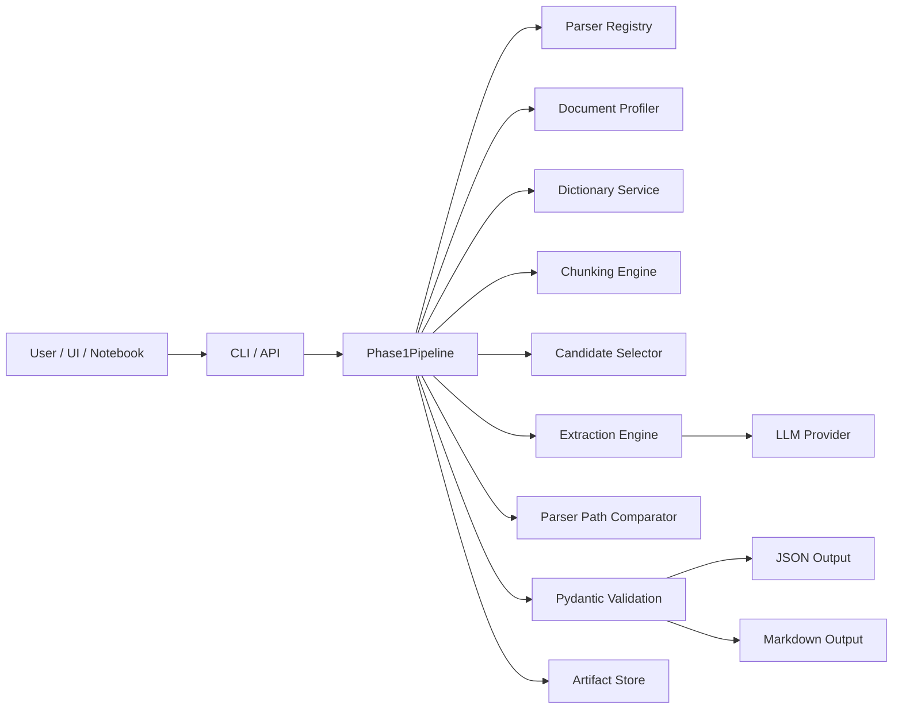
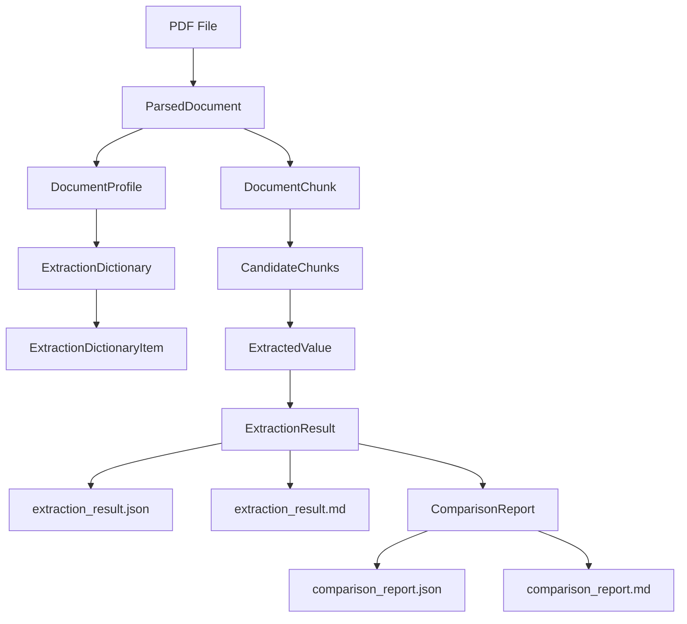
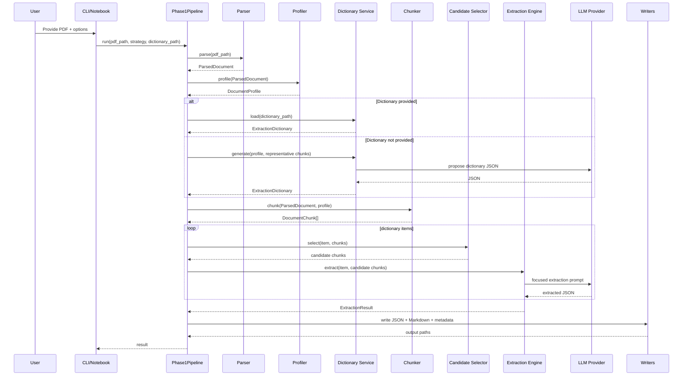
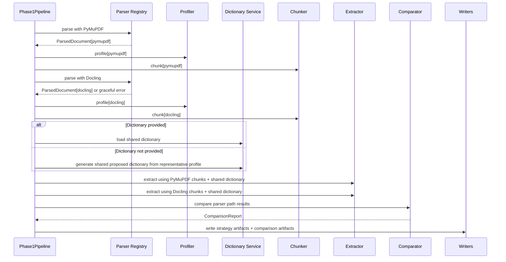

# architecture.md - Phase 1 Large PDF Extraction Architecture

## 1. Objective

Phase 1 builds a generic extraction foundation for large PDFs. The system must transform a large PDF into structured JSON and Markdown through a reliable, auditable pipeline.

The core problem is not simply extracting text. The problem is extracting useful, source-grounded, validated information from long documents where direct one-shot LLM extraction is unreliable.

The architecture therefore separates the problem into independent layers:

1. Document parsing.
2. Document profiling.
3. Dictionary generation/loading.
4. Parser-aware chunking.
5. Candidate chunk selection.
6. Dictionary-driven extraction.
7. Validation.
8. Rendering.
9. Parser/chunking comparison.
10. Run metadata and traceability.

## 2. Reference Example

The provided reference PDF is a CME metals options daily bulletin. It is useful because it contains several patterns common in difficult enterprise PDFs:

- 60+ pages.
- Repeated headers and footers.
- Dense tables.
- Multi-line column names.
- Product and contract sections.
- Expiration dates.
- Numeric market fields such as volume, open interest, settlement price, point change, delta, and exercise count.
- Recurring disclaimers.

This architecture must support those patterns without hard-coding them. A contract, policy document, financial report, research paper, or operations bulletin should use the same pipeline.

## 3. Critical Phase 1 Decision: Dictionary Before Extraction

## 2A. Domain Orientation: Finance Market Operations Technology

The initial target documents are expected to come from Finance / Markets / Operations Technology. This includes documents such as market operations bulletins, settlement reports, clearing reports, reconciliation outputs, exception reports, margin/collateral documents, trade lifecycle reports, regulatory/control reports, payment operations documents, and confirmations.

The domain orientation affects **dictionary proposal** and **candidate-selection hints**, not the core architecture. The parser, profiler, chunker, extractor, renderer, and Pydantic models must remain document-type agnostic.

Finance Market Ops documents commonly include dense tables, repeated legal or control text, product sections, business dates, report dates, trade and settlement dates, contract identifiers, counterparty or legal entity identifiers, quantities, prices, rates, notionals, settlement amounts, margin/collateral values, exposure, variance, P&L, volume, open interest, status indicators, exceptions, and disclaimers.

Architectural rule: finance-aware intelligence belongs in externalized configuration, dictionary templates, prompts, examples, or future domain packs. It must not be embedded as brittle one-off parsing rules for CME, metals, options, futures, or any individual document.


The extraction dictionary must be created or loaded before final extraction. This is the most important design principle for Phase 1.

The dictionary is the extraction contract. It defines:

- what fields/entities should be extracted
- where those fields are likely to appear
- how to instruct the LLM
- expected value type
- examples or aliases
- normalization hints
- candidate selection hints

The pipeline must not extract everything first and then create a dictionary. That approach produces unstable JSON and makes UI integration difficult.

Correct sequence:

```text
parse -> profile -> propose/load dictionary -> validate dictionary -> chunk -> select candidates -> extract -> validate -> render
```

Why the dictionary comes before chunk-driven extraction:

1. It gives the LLM a stable target.
2. It lets the system select relevant chunks per field.
3. It makes JSON output predictable for UI consumption.
4. It makes future scoring/evaluation possible.
5. It allows the same dictionary to be reused across parser strategies.
6. It creates a natural bridge to future agentic workflows.

## 4. System Context



## 5. Layered Design

```text
Interface Layer
  - CLI
  - Notebook
  - Future API

Application Layer
  - Phase1Pipeline
  - Run orchestration
  - Compare-mode orchestration
  - Error handling

Domain Layer
  - Pydantic models
  - Enums
  - Schema validation
  - Run state

Service Layer
  - Document profiler
  - Dictionary service
  - Chunking service
  - Candidate selector
  - Extraction service
  - Comparison service

Infrastructure Layer
  - PDF parsers
  - LLM providers
  - File/artifact writers
  - Logging
```

## 6. Main Components

### 6.1 Parser Registry

Purpose: Convert PDF files into `ParsedDocument` objects through interchangeable parser strategies.

Parser implementations:

1. `PyMuPDFTextParser`
   - Fast baseline parser.
   - Extracts page text.
   - Captures page count and metadata.
   - Works even when Docling is unavailable.
   - Useful for quick local smoke tests.

2. `DoclingParser`
   - Richer layout-aware parser.
   - Extracts document structure and tables where possible.
   - Useful for complex PDFs.
   - Must fail gracefully if dependency is unavailable.

Both parsers must produce the same Pydantic output contract:

```text
PDF -> ParsedDocument -> ParsedPage[]
```

### 6.2 Document Profiler

Purpose: Summarize the parsed document before dictionary generation and chunking.

The profiler should compute:

- page count
- character count
- empty or low-text pages
- probable headings
- probable table regions
- repeated header candidates
- repeated footer candidates
- representative pages/chunks for dictionary generation
- basic parser warnings

The document profile is used by:

- dictionary generator
- chunking strategy
- parser comparison report
- future quality scoring phase

### 6.3 Extraction Dictionary Service

Purpose: Define what to extract.

A dictionary item contains:

- `document_section`
- `entity_name`
- `description`
- `instruction_prompt`
- `expected_type`
- `required`
- `examples`
- `normalization_hint`
- `candidate_selection_hints`

Two modes are required:

1. Proposed dictionary mode
   - The system samples representative chunks/profile signals.
   - The LLM proposes useful extraction fields.
   - Output is saved as `extraction_dictionary.proposed.json`.
   - The proposed dictionary is validated before use.

2. Provided dictionary mode
   - The user supplies a curated dictionary.
   - The system validates it with Pydantic.
   - Extraction uses this dictionary exactly.

In compare mode, a single shared dictionary must be used for both parser paths. If no dictionary is provided, generate one proposed dictionary from a combined representative profile. This avoids comparing two different schemas.

### 6.4 Parser-Aware Chunking Engine

Purpose: Convert `ParsedDocument` into `DocumentChunk` objects that fit LLM context windows and preserve source traceability.

Chunking is parser-aware:

- PyMuPDF text output may require heuristic table-like chunk detection.
- Docling output may provide explicit table/layout structures.
- Both paths must still produce the same `DocumentChunk` model.

Chunking dimensions:

- page boundaries
- section headings
- table boundaries
- token estimates
- repeated header/footer detection
- overlap for narrative text
- source spans

Chunk metadata should include:

- page range
- heading if detected
- parser strategy
- table indicator if table-like
- chunk hash
- source spans

### 6.5 Candidate Selector

Purpose: Select relevant chunks for each dictionary item before calling the LLM.

Initial Phase 1 logic can be simple and deterministic:

- match document section keywords
- match entity name keywords
- match examples
- use candidate selection hints
- include early chunks for document metadata
- include table-like chunks for table fields
- enforce max candidate chunks per dictionary item

Later phases can replace this with embeddings, reranking, or agentic search.

### 6.6 Extraction Engine

Purpose: Extract dictionary items from candidate chunks.

Process:

```text
for each dictionary item:
    select candidate chunks
    build focused prompt
    call LLM provider
    parse strict JSON
    validate ExtractedValue
    attach source spans
merge values into ExtractionResult
```

The extractor should preserve raw values. Normalized values are optional in Phase 1 and should only be added when unambiguous.

### 6.7 Parser Path Comparator

Purpose: Compare PyMuPDF and Docling parser/chunking paths before Phase 2 evaluation is available.

This comparison is not reliability scoring. It is a transparent engineering report.

The comparator accepts:

```text
ParserPathResult[pymupdf]
ParserPathResult[docling]
Shared ExtractionDictionary
```

It produces:

```text
ComparisonReport
comparison_report.json
comparison_report.md
```

Metrics:

- parse runtime
- page count
- extracted character count
- low-text page count
- detected table count
- detected heading count
- chunk count
- average chunk token estimate
- max chunk token estimate
- table-like chunk count
- repeated header/footer candidates
- candidate chunk coverage per dictionary item
- extracted field presence per dictionary item
- warnings/errors
- JSON result diff summary

The report may include recommendation notes such as:

- Docling preserved more table structure.
- PyMuPDF produced more text coverage.
- Both paths found the required document metadata.
- One parser skipped pages or failed.

Recommendation notes are engineering observations, not formal accuracy claims.

### 6.8 LLM Provider Interface

All LLM calls go through a provider interface:

```python
class LLMProvider(Protocol):
    def generate_json(self, system_prompt: str, user_prompt: str) -> dict:
        ...
```

Implement:

- `FakeLLMProvider` for tests.
- `GeminiProvider` as optional.
- `OpenAIProvider` as optional.

No core pipeline code should directly import a vendor SDK.

### 6.9 Output Renderers

Two outputs are mandatory:

1. JSON
   - Machine-readable.
   - Pydantic-validated.
   - UI/API ready.

2. Markdown
   - Human-readable.
   - Useful for review and debugging.
   - Contains extracted values, warnings, and source traceability.

Comparison mode also renders:

- `comparison_report.json`
- `comparison_report.md`

## 7. Data Model Flow



## 8. Phase 1 Runtime Sequence

### 8.1 Single Strategy Mode



### 8.2 Compare Mode



## 9. Phase 1 Artifact Flow

For single strategy mode:

```text
parsed_document.<strategy>.json
  -> document_profile.<strategy>.json
  -> extraction_dictionary.proposed.json or extraction_dictionary.used.json
  -> chunks.<strategy>.jsonl
  -> extraction_result.<strategy>.json
  -> extraction_result.<strategy>.md
  -> run_metadata.json
```

For compare mode:

```text
parsed_document.pymupdf.json
parsed_document.docling.json

document_profile.pymupdf.json
document_profile.docling.json

extraction_dictionary.used.json

chunks.pymupdf.jsonl
chunks.docling.jsonl

extraction_result.pymupdf.json
extraction_result.docling.json

comparison_report.json
comparison_report.md
run_metadata.json
```

## 10. Future Agentic Architecture Compatibility

Phase 1 should be built as a deterministic service pipeline, but the service boundaries should map naturally to future agent tools.

Future agent tools:

```text
Tool: parse_pdf
Input: pdf_path, strategy
Output: ParsedDocument artifact

Tool: profile_document
Input: ParsedDocument
Output: DocumentProfile artifact

Tool: propose_dictionary
Input: DocumentProfile, representative chunks
Output: ExtractionDictionary artifact

Tool: validate_dictionary
Input: dictionary path or object
Output: validated ExtractionDictionary

Tool: chunk_document
Input: ParsedDocument, DocumentProfile
Output: DocumentChunk artifacts

Tool: extract_dictionary_item
Input: dictionary item, candidate chunks
Output: ExtractedValue

Tool: compare_parser_paths
Input: ParserPathResult[]
Output: ComparisonReport

Tool: render_results
Input: ExtractionResult
Output: JSON and Markdown artifacts
```

Design implications:

- No hidden global state.
- Every step accepts explicit input and returns a Pydantic object.
- Every artifact has a path and metadata.
- Every extraction result has source spans.
- Run state is serializable.
- Failures are captured as structured warnings/errors.

This makes the future agentic flow easier: an agent can inspect run state, decide to reparse with a different strategy, request a dictionary revision, rerun selected chunks, or ask a human for approval.

## 11. Explicit Non-Goals for Phase 1

Do not implement yet:

- reliability scoring using Gemma, Mistral, Llama, or Qwen
- online evaluation dashboard
- offline human annotation evaluation
- DSPy prompt optimization
- chatbot/RAG over extracted outputs
- multi-agent orchestration
- long-term memory
- approval workflow

However, leave interfaces and artifacts clean enough for those later phases.

## 12. Implementation Priorities

Build in this order:

1. Domain models.
2. Artifact store.
3. PyMuPDF parser.
4. Document profiler.
5. Dictionary loader and validator.
6. Fake dictionary generator.
7. Chunking service.
8. Candidate selector.
9. Fake LLM extractor.
10. JSON/Markdown renderers.
11. Docling parser behind interface.
12. Parser path comparator.
13. CLI commands.
14. Smoke-test notebook.
15. Parser-comparison notebook.
16. Unit/integration tests.

## 13. Acceptance Criteria

Phase 1 is acceptable when:

- The system can process a 60+ page PDF without sending the entire document to the LLM in one prompt.
- The dictionary is generated or loaded before extraction.
- The same dictionary can be used across PyMuPDF and Docling paths.
- PyMuPDF path works locally with fake LLM.
- Docling path works if Docling is installed and fails gracefully otherwise.
- Compare mode produces a useful parser/chunking comparison report.
- Extracted values include source page/chunk traceability.
- JSON and Markdown outputs are generated.
- Unit and integration tests pass.
- Code can later be wrapped as an agentic workflow without major refactoring.

## 14. Notebook-Based Phase 1 Demonstration

The architecture includes a notebook as a first-class validation artifact, not an afterthought.

Notebook path:

```text
notebooks/01_phase1_cme_reference_demo.ipynb
```

Reference inputs expected in the repository:

```text
data/input/Metals_Option_Products.pdf
data/input/metal_options_summary.rtf
```

The notebook exercises the same application services and Pydantic models used by the CLI. It must not contain a separate one-off implementation of the pipeline.

Notebook flow:

```text
load config
  -> verify input files
  -> inspect PDF/profile sample
  -> propose dictionary first
  -> validate dictionary
  -> run PyMuPDF path
  -> run Docling path or graceful skip
  -> run compare mode
  -> validate JSON artifacts
  -> render Markdown previews
  -> display artifact summary and acceptance checklist
```

Architectural rule: if a behavior is shown in the notebook, it must be implemented in reusable source code under `src/large_pdf_extractor/`, not embedded only in notebook cells.

The notebook provides early confidence before Phase 2 online/offline eval exists. It does not replace formal evaluation; it proves that Phase 1 can parse, profile, build dictionary, chunk, extract, compare, validate, and render outputs on a difficult 60-page reference PDF.

